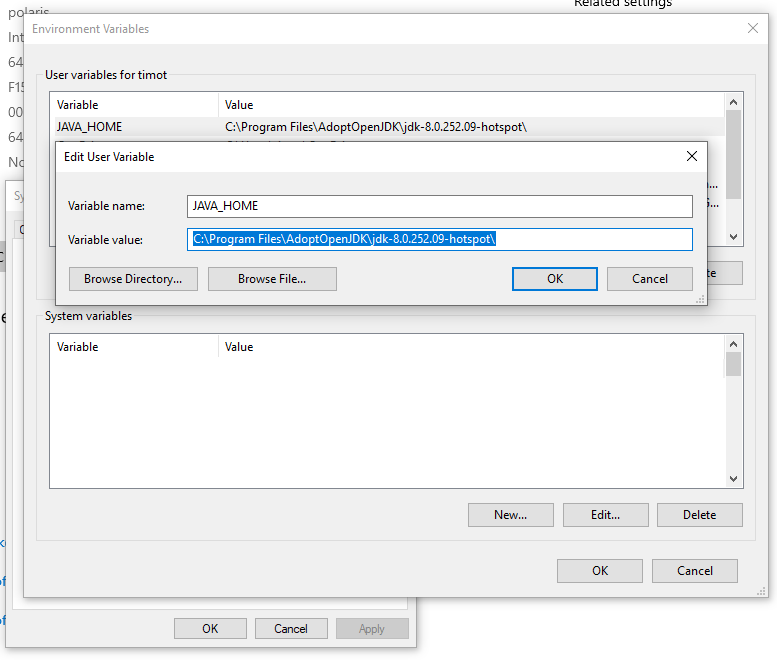
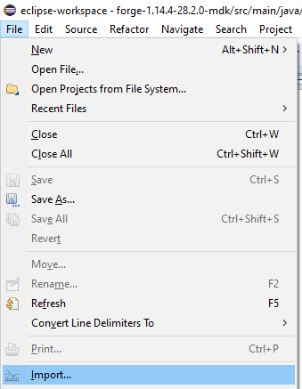
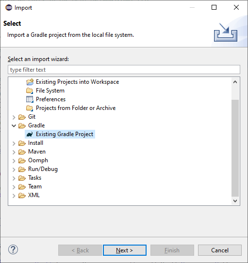
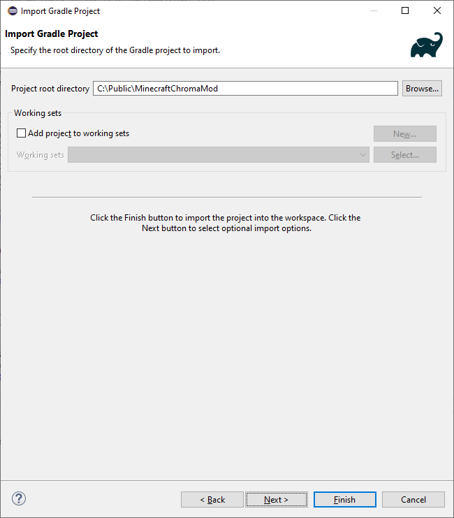
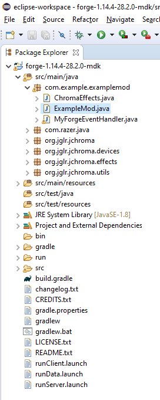
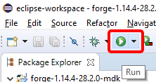
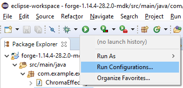
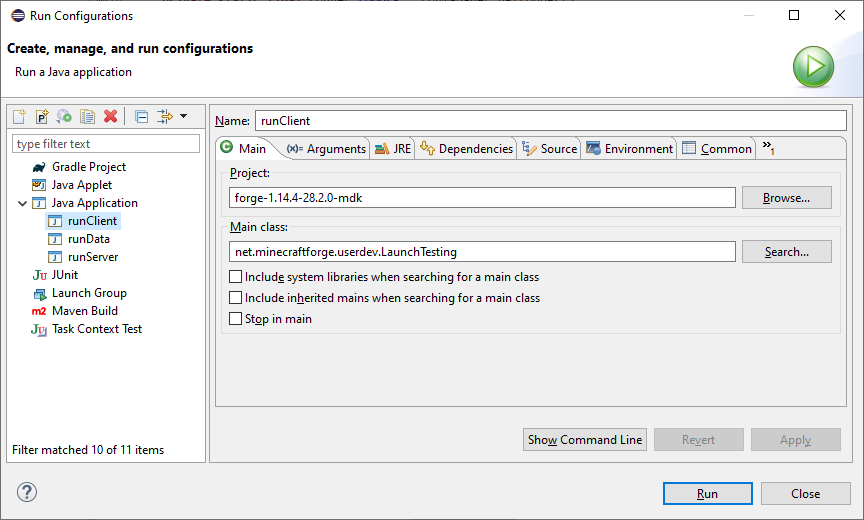

# Minecraft Chroma Mod

This Mod is built with [MinecraftForge](https://minecraftforge.net) and displays `Chroma RGB` effects for various game events.

[JChromaSDK.java](https://github.com/tgraupmann/MinecraftChromaMod/blob/master/src/main/java/com/razer/java/JChromaSDK.java) exposes the C++ `CChromaEditor` library functions for `Java`.

`JChromaSDK` is able to play Razer Chroma animations from the [Project Resources](https://github.com/tgraupmann/MinecraftChromaMod/tree/master/src/main/resources/Animations).


## Table of Contents

* [See Also](#see-also)
* [Quick Start](#quick-start)
* [Chroma Effects](#chroma-effects)
* [Videos](#videos)
* [Setup and Build](#setup-and-build)


## See Also

* [Minecraft Forge Forums](https://forums.minecraftforge.net/)

* [Minecraft Forge Documentation](https://mcforge.readthedocs.io/en/latest/)

**Docs:**

- [Chroma Animation Guide](http://chroma.razer.com/ChromaGuide/) - Visual examples of the Chroma Animation API methods

**Mods:**

- [MinecraftChromaMod](https://github.com/tgraupmann/MinecraftChromaMod) - Minecraft Chroma RGB Mod

- [RobloxSampleChromaMod](https://github.com/tgraupmann/RobloxSampleChromaMod) - Roblox Sample Chroma RGB Mod

- [Cpp_RustChromaModClient](https://github.com/tgraupmann/Cpp_RustChromaModClient) - Rust Chroma RGB Mod Client


**Editors:**

- [Web Chroma Editor](https://chroma.razer.com/ChromaEditor/) - Create Chroma RGB Animations


## Quick Start ##

* Visit the [Releases Section](https://github.com/tgraupmann/MinecraftChromaMod/releases) to run the installers.

* Use the Minecraft Forge Universal Installer for client and server

* Use the mod installer that matches the Minecraft Forge version

* To run Minecraft as a dedicated server and use Chroma on the clients, install the [server mod](https://github.com/tgraupmann/MinecraftChromaModServer/releases) on the server.

The client mod with Chroma will be allowed because the `modid` matches on server and client.

* To run a dedicated server, run the following in the `command-prompt`.

```
CD %appdata%\.minecraft
java -Xmx4096M -jar forge-1.16.4-35.1.13.jar nogui
```

* Or put a batch file in your `.minecraft` folder to start the server.

**run_minecraft_server.cmd**
```
java -Xmx4096M -jar forge-1.16.4-35.1.13.jar nogui
```

* The server will not be able to run the client mod. So you'll want to uninstall the client mod on the server and install the server mod on the server.

* Connect to Minecraft dedicated servers using port: `25565`.


## Chroma Effects ##

* Base Effect

* Main Menu Effect

* In Water Effect

* Place Block Effect

* Craft Item Effect

* Player Damage Effect

* Fire Arrow Effect

* Kill Pig Effect

* Kill Chicken Effect

* Open Chest Effect

* Open Door Effect

* Close Door Effect

* Sword Attack Effect

* Spawn Fish Effect

* Potion Effect

* Raining Effect

* Snowing Effect

* Ladder Effect

* Riding Cart Effect


## Videos ##


**Setup Video**

<a target="_blank" href="https://youtu.be/v279Tv3RpTM"></a>


**Intro Video**

<a target="_blank" href="https://youtu.be/0Y731q8HrPs"></a>


**More Chroma Effects**

<a target="_blank" href="https://youtu.be/7Ey3PRJa72Y"></a>

**Weather**

<a target="_blank" href="https://youtu.be/kFtd75cmfeo"></a>


## Setup and Build ###

This section is only needed to build a new mod installer or to make changes to the mod.

* Install [JDK 1.8 or better](https://www.oracle.com/technetwork/java/javase/downloads/jdk8-downloads-2133151.html)

* You can also use [OpenJDK](https://adoptopenjdk.net/?variant=openjdk8&jvmVariant=hotspot). Use `OpenJDK 8 (LTS)`

* Set the `JAVA_HOME` environment variable to the path of the 64-bit version of the JDK. Gradle will report out of memory with the 32-bit JDK version which can be fixed in the `gradle.properties` file if you have to.

The path will vary depending on the JAVA version that you install.

```
JAVA_HOME
C:\Program Files\AdoptOpenJDK\jdk-8.0.252.09-hotspot\
```



* Install the [Eclipse IDE](https://www.eclipse.org/eclipseide/)

* Install the latest MinecraftForge `server` and `client` using the [Windows Installer](http://files.minecraftforge.net/)

**Above: Install the Server and Client**

* Make sure you do both for the Minecraft Forge handshake to work.

* That means double-click `forge-1.16.3-34.1.0-installer.jar` and use the UI to install both.

**Get the mod**

* Download and extract to a folder like:
```C:\Minecraft\forge-1.16.3-34.1.0-mdk```

* Make sure the path isn't too long to avoid compile errors.


**Generate Eclipse Project**

```
gradlew genEclipseRuns
```

**Launch Eclipse**

**Use the `File->Import` menu item**



**Select `Gradle\Existing Gradle Project` and click `Next`**



**Browse to the `MinecraftChromaMod` folder and click `Finish`**



**If the import is successful, the project shouldn't have any compile errors.**



**Use the `Run` toolbar drop down**



**Select `Run Configurations...`**



**Start the mod (from Eclipse)**

* Select the `Java Application` -&gt; `runClient` and click `Run`



**Start the mod (on the command-line)**

```
gradlew runClient
```

**Build the `build\libs\modid-1.0.jar`**

```
gradlew build
```

**Build the installer with InnoSetup**

# Support

Support is available on Discord, you can reach me at `Tim Graupmann#0611`.
